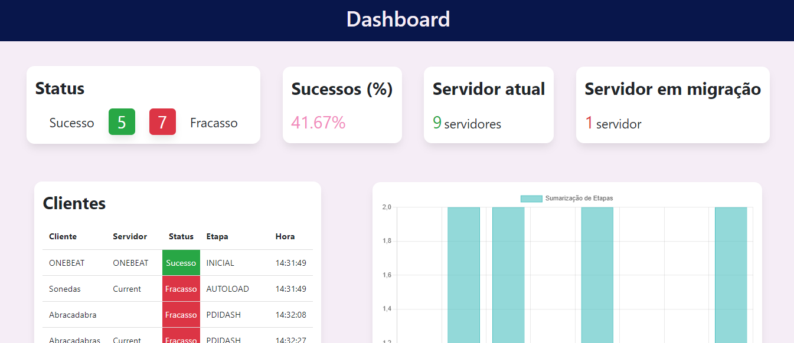

# Dashboard

### Como rodar a aplicação

- Baixe ou clone o projeto
- Em src/ rode o comando `npm install` ou `yarn install` para instalar as dependências(Tenha certeza de ter o Node instalado em sua máquina).
- Para iniciar a aplicação, rode o comando `npm start` ou `yarn start`, dessa forma a aplicação já estará disponível na porta http://localhost:3000.

- A seguinte tela deverá aparecer:

